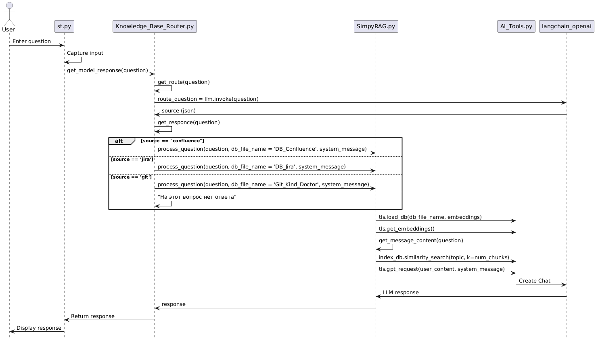
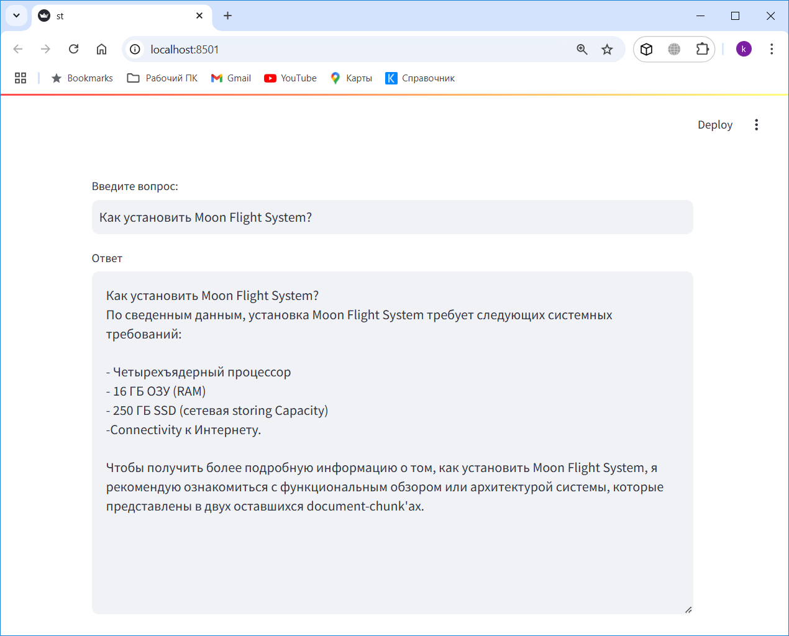

# GAI_KMS_02
Полностью локальная версия!
Используются:
- LM Studio: https://lmstudio.ai/
- LLM: `bartowski/Llama-3.2-3B-Instruct-GGUF/Llama-3.2-3B-Instruct-f16.gguf`
- Embeddings: `intfloat/multilingual-e5-large`

## Описание
Это прототип решения типа Agentic RAG (Retrieval-Augmented Generation) с данными из Jira, Confluence и Git.

Система управления знаниями GenAI-Powered Knowledge Management System» предназначена для оптимизации управления 
знаниями в организации с использованием передовых возможностей искусственного интеллекта.

**1. Взаимодействие с пользователем (User Interaction):**

* **User**: Процесс начинается с пользователя, который задает вопрос агентам AI.
* **GenAI_Agent**: Агенты GenAI являются ключевыми компонентами, получающими вопросы от пользователей и 
предоставляющими ответы.

**2. Управление контекстом (Context Management):**

* **Контекст данных (Data Context)**: Агенты GenAI взаимодействуют с контекстом данных, размещенным в истории чата. 
Они получают данные контекста и обновляют их по мере необходимости, обеспечивая актуальный поток информации.

**3. Использование инструментов (Tool Utilization):**

* **Инструмент поиска и суммаризации (Search Tool & Summary Tool)**: Для предоставления точных и релевантных ответов 
агенты GenAI используют инструменты поиска и суммаризации. Эти инструменты взаимодействуют с векторными базами данных 
для извлечения релевантных фрагментов информации.

**4. Внешний поиск (External Search):**

* **Вебпоиск (WebSearch)**: В дополнение к внутренним данным агенты GenAI могут выполнять веб-поиск для сбора 
дополнительной информации, которая может иметь отношение к вопросу пользователя.

**5. Загрузка данных (Data Ingestion):**

* **Загрузчики документов (Document Loaders)**: Эти компоненты наполняют векторные базы данных из различных исходных 
систем - Jira, Confluence и Git, обеспечивая агентам GenAI богатый набор данных для работы.

Эта архитектура обеспечивает бесшовную интеграцию данных и интеллектуальное разрешение запросов, используя как 
структурированные внутренние данные, так и внешние ресурсы для повышения эффективности управления знаниями.

# Реализация

## 0.Генерация синтетических данных

### 0.1. Генерация синтетических данных в формате JSON для эмуляции данных Confluence
(_01_SyntheticDataGeneration_Confluence.py_)

Этот модуль предназначен для генерации запрошенного количества записей синтетических данных, 
с метаданными и описаниями, и сохранить их в указанном JSON-файле.

Данные посвящены описанию вымышленного программного продукта под названием «Moon Flight System».

### 0.2. Генерация синтетических данных в формате CSV для эмуляции данных Jira (_02_SyntheticDataGeneration_Jira.py_)

Этот модуль использует библиотеку Faker для генерации реалистичных случайных данных для различных полей.

Данные содержат информацию о тикетах Jira для вымышленного программного продукта под названием «Moon Flight System».

### 1.1. Создание новой векторной базы знаний для Jira (_11_Create_Vector_Db_Jira.py_)
Этот модуль предназначен для преобразования CSV-файла с данными тикетов Jira в формат JSON, 
разбивает данные на фрагменты и создает векторную базу данных FAISS для эффективного поиска. 

### 1.2. Создание новой векторной базы знаний для Confluence (_12_Create_Vector_Db_Confluence.py_)

Этот Python-модуль обрабатывает JSON-файл, содержащий данные Confluence, разбивает их на фрагменты, 
и создает векторную базу данных FAISS для эффективного поиска. 

###  1.3. Создание новой базы знаний для Git (_13_Create_Vector_Db__Git.py_)
Этот Python-модуль предназначен для клонирования Git-репозитория, загрузки из него определенных файлов, 
разделение данных на фрагменты (chunks) и создания векторной базы знаний.  

### 2. Простой RAG для Jira или Confluence или Git (_SimpyRAG.py_)
Этот модуль предназначен для обработки и извлечения определенной информации:
- из векторной базы тикетов Jira 
- из векторной базы документов системы Confluence
- из векторной базы знаний клонированого Git-репозитория.

### 3. Agents (_Knowledge_Base_Router.py_)
Данный код реализует систему обработки вопросов пользователей, направляя их в соответствующие базы данных в зависимости 
от тематики вопроса. 

1. **Функция `get_route`**:
   - Берет вопрос пользователя и определяет, в какую из систем (Jira, Confluence, Git или другое) его следует направить.
   - Использует модель ChatOpenAI для интерпретации вопроса и возвращает ответ с указанием источника:
   - source = 'confluence'
   - source = 'jira'
   - source = 'git' 
   - source = 'other' - если тема не определена, то другое;
   - source = 'unknown' - в случае ошибки.

2. **Функция `get_responce`**:
   - Сначала вызывает `get_route` для определения источника вопроса.
   - В зависимости от источника вызывает функцию `process_question` с соответствующей векторной базой знаний и системым промтом.
   - Если источник не определен, возвращает стандартный ответ.

1. **Пользовательское взаимодействие**: Пользователь вводит вопрос в интерфейсе, обрабатываемом модулем `st.py`.

2. **Передача вопроса**: Вопрос передается от `st.py` к `Knowledge_Base_Router`, где осуществляется вызов функции `get_model_response`.

3. **Маршрутизация запроса**:
   - Внутри `Knowledge_Base_Router`, функция `get_route` используется для определения типа источника, к которому следует отнести вопрос. 
   Поэтому вопрос отправляется в `ChatOpenAI` для выполнения обработки и возврата JSON с возможными значениями: `jira`, `confluence`, `git` 
   или `other`. В случае ошибки - `unknown`.

4. **Обработка запроса**: 
   - На основании маршрутизации вопроса (в зависимости от идентифицированного источника) вызывается `process_question` в `SimpyRAG`.
   - Подгружается соответствующая база данных с помощью `AI_Tools`, используя функцию `tls.load_db`.

5. **Получение содержания сообщения**: 
   - В `SimpyRAG` осуществляется вызов функции `get_message_content` для извлечения наиболее релевантных фрагментов из базы данных, 
   основываясь на векторах, созданных с помощью `get_embeddings`.

6. **Запрос к моделям LLM**: 
   - Затем, вызов `tls.gpt_request` используется для отправки пользовательского запроса к языковой модели, развернутой на `ChatOpenAI`, 
   и получение ответа.

7. **Возврат ответа**: 
   - Ответ от `SimpyRAG` возвращается в `Knowledge_Base_Router`, который его передает обратно в `st.py` для отображения пользователю.

### _AI_Tools.py_
Этот модуль позволяет расширить возможности обработки и поиска текстов с использованием вкраплений 
и других методов обработки естественного языка. В нем используются различные инструменты, такие как OpenAI 
для генерации ответов, FAISS для эффективного поиска векторного сходства, Loguru для надежного протоколирования, 
а также LangChain для разбиения текста на удобные фрагменты и вычисления вкраплений.

### _st.py_

Приме GUI на Streamlit. 

Запускать так:

Открываем в браузере по адресу `http://localhost:8501/`

Приглашаю в Телеграм общаться по это теме: https://t.me/AiExp01