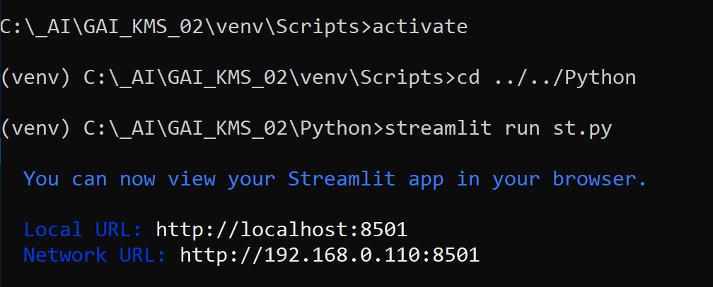

# GAI_KMS_02
Полностью локальная версия для использование вместе с LM Studio
Используется модель `bartowski/Llama-3.2-3B-Instruct-GGUF/Llama-3.2-3B-Instruct-f16.gguf`

## Описание
Это прототип решения типа Agentic RAG (Retrieval-Augmented Generation) на основе LangGraph с данными из Jira, Confluence и Git.

Система управления знаниями GenAI-Powered Knowledge Management System» предназначена для оптимизации управления 
знаниями в организации с использованием передовых возможностей искусственного интеллекта.

**1. Взаимодействие с пользователем (User Interaction):**

* **User**: Процесс начинается с пользователя, который задает вопрос агентам AI.
* **GenAI_Agent**: Агенты GenAI являются ключевыми компонентами, получающими вопросы от пользователей и 
предоставляющими ответы.

**2. Управление контекстом (Context Management):**

* **Контекст данных (Data Context)**: Агенты GenAI взаимодействуют с контекстом данных, размещенным в истории чата. 
Они получают данные контекста и обновляют их по мере необходимости, обеспечивая актуальный поток информации.

**3. Использование инструментов (Tool Utilization):**

* **Инструмент поиска и суммаризации (Search Tool & Summary Tool)**: Для предоставления точных и релевантных ответов 
агенты GenAI используют инструменты поиска и суммаризации. Эти инструменты взаимодействуют с векторными базами данных 
для извлечения релевантных фрагментов информации.

**4. Внешний поиск (External Search):**

* **Вебпоиск (WebSearch)**: В дополнение к внутренним данным агенты GenAI могут выполнять веб-поиск для сбора 
дополнительной информации, которая может иметь отношение к вопросу пользователя.

**5. Загрузка данных (Data Ingestion):**

* **Загрузчики документов (Document Loaders)**: Эти компоненты наполняют векторные базы данных из различных исходных 
систем - Jira, Confluence и Git, обеспечивая агентам GenAI богатый набор данных для работы.

Эта архитектура обеспечивает бесшовную интеграцию данных и интеллектуальное разрешение запросов, используя как 
структурированные внутренние данные, так и внешние ресурсы для повышения эффективности управления знаниями.

### Используемые материалы:

Course: **AI Agents in LangGraph** https://learn.deeplearning.ai/courses/ai-agents-in-langgraph/lesson/1/introduction

Documentation: https://python.langchain.com/v0.2/docs/introduction/

GitHub: https://github.com/langchain-ai/langgraph/tree/main

LangGraph and RAG: https://github.com/langchain-ai/langgraph/tree/main/examples/rag

Agentic RAG: https://github.com/langchain-ai/langgraph/blob/main/examples/rag/langgraph_agentic_rag.ipynb

## Теория:
**Узлы и грани**

Мы можем построить агентский граф RAG следующим образом:

* Состояние - это набор сообщений.
* Каждый узел обновляет (добавляет в) состояние.
* Условные ребра решают, какой узел посетить следующим

# Реализация

## 0.Генерация синтетических данных

### 0.1. Генерация синтетических данных в формате JSON для эмуляции данных Confluence
(_01_SyntheticDataGeneration_Confluence.py_)

Этот модуль предназначен для генерации запрошенного количества записей синтетических данных, 
с метаданными и описаниями, и сохранить их в указанном JSON-файле.

Данные посвящены описанию вымышленного программного продукта под названием «Moon Flight System».

### 0.2. Генерация синтетических данных в формате CSV для эмуляции данных Jira (_02_SyntheticDataGeneration_Jira.py_)

Этот модуль использует библиотеку Faker для генерации реалистичных случайных данных для различных полей.

Данные содержат информацию о тикетах Jira для вымышленного программного продукта под названием «Moon Flight System».

### 1.1. Создание новой векторной базы знаний для Jira (_11_Create_Vector_Db_Jira.py_)
Этот модуль предназначен для преобразования CSV-файла с данными тикетов Jira в формат JSON, 
разбивает данные на фрагменты и создает векторную базу данных FAISS для эффективного поиска. 

**Краткое описание**

1. **Преобразование из CSV to JSON**: Преобразует указанный CSV-файл в JSON-файл для сохранении информации о заголовках 
столбцов.
2. **Загрузка документа**: Загружает JSON-файл и обрабатывает его с помощью Langchain `TextLoader`.
3. **Разделение текста (Text Splitting)**: Разбивает загруженный текстовый документ на фрагменты (chunks) с помощью 
Langchain's `RecursiveCharacterTextSplitter`.
4. **Создание базы данных**: Создает векторную базу данных FAISS на основе обработанных текстовых фрагментов (chunks) 
для эффективного поиска и хранения информации.

### 1.2. Создание новой векторной базы знаний для Confluence (_12_Create_Vector_Db_Confluence.py_)

Этот Python-модуль обрабатывает JSON-файл, содержащий данные Confluence, разбивает их на фрагменты, 
и создает векторную базу данных FAISS для эффективного поиска. 

**Краткое описание**

- **Загрузка данных в формате JSON**: Считывает данные Confluence из файла JSON.
- **Создание документа**: Преобразует JSON-данные в объекты `Document`, совместимые с Langchain.
- **Разделение текста (Text Splitting)**: Разбивает документ на фрагменты (chunks).
- **Создание базы данных**: Создает векторную базу данных FAISS из фрагментов документов для эффективного поиска данных.

###  1.3. Создание новой базы знаний для Git (_13_Create_Vector_Db__Git.py_)
Этот Python-модуль предназначен для клонирования Git-репозитория, загрузки из него определенных файлов, 
разделение данных на фрагменты (chunks) и создания векторной базы знаний.  

**Краткое описание**
- **Клонирование репозитория Git**: Клонирует определенный Git-репозиторий с GitHub в локальную директорию.
- **Загрузка документов**: Использует `GitLoader` для загрузки документов из клонированного репозитория.
- **Фильтрация**: Фильтрует загруженные документы, чтобы использовать только файлы Python.
- **Разделение текста (Text Splitting)**: Разделяет содержимое загруженных документов на фрагменты (chunks).
- **Создание векторной базы данных**: Создает векторную базу данных FAISS из фрагментов документов для эффективного 
поиска данных.

### 2.1. Простой RAG для Jira (_21_RAG_Jira.py_)
Этот модуль предназначен для обработки и извлечения определенной информации из набора данных тикетов Jira 
используя векторную базу знаний.

### 2.2. Простой RAG для Confluence (_22_RAG_Confluence.py_)
Этот модуль предназначен для обработки и извлечения определенной информации из системы Confluence используя векторную 
базу знаний.

### 2.3. (_23_RAG_Git.py_)
Этот модуль позволяет извлекать и обрабатывать исходные файлы Python из векторной базы знаний клонированого 
Git-репозитория. 

### 3.0. Agents (_30_Agents.py_)
Этот модуль объединяет различные инструменты искусственного интеллекта для создания интеллектуального агента, 
способного отвечать на запросы связанные с тикетами в Jira и документацией в Confluence. 
Он использует ретриверы (retrievers) для получения необходимой информации из предварительно загруженных баз данных, 
лингвистические модели для интерпретации и генерации ответов, 
и граф процесса (workflow graph) для управления процессом принятия решений агентом.

**Краткое описание**

1. **Загрузка баз данных**:
   - Загружает базы данных Jira и Confluence в ретриверы (retrievers) для выполнения запросов.

2. **Создание инструментов ретривера (retrievers)**:
   - Настраивает инструменты для запросов к тикетам в Jira и документации в Confluence.

3. **Определение состояния агента**:
   - Определяет состояние агента, которое будет включать сообщения.

4. **Узлы графа**:
   - **Агент**: Обрабатывает вызов модели агента.
   - **Retrieve**: Извлекает документы с помощью ретриверов.
   - **Rewrite**: Переписывает запросы, чтобы сделать их более эффективными.
   - **Генерировать**: Генерирует ответы на основе соответствующих документов.

5. **Ребра  графа**:
   - Определяет процесс взаимодействия различных узлов в зависимости от условий.

6. **Основное выполнение**:
   - Инициализирует ведение журнала и демонстрирует его использование с помощью примеров запросов.

Интегрируя различные компоненты искусственного интеллекта, этот модуль представляет собой интерактивного агента, способного обрабатывать сложные запросы 
и получать необходимую информацию динамически.

### 3.1. Agents (_Agents.py_)

Этот модуль аналогичен модулю _30_Agents.py_, описанному выше. Добавлена возможность отвечать на запросы, связанные с Git.

### _AI_Tools.py_
Этот модуль позволяет расширить возможности обработки и поиска текстов с использованием вкраплений 
и других методов обработки естественного языка. В нем используются различные инструменты, такие как OpenAI 
для генерации ответов, FAISS для эффективного поиска векторного сходства, Loguru для надежного протоколирования, 
а также LangChain для разбиения текста на удобные фрагменты и вычисления вкраплений.

### _st.py_

Приме GUI на Streamlit. 

Запускать так:

Открываем в браузере по адресу `http://localhost:8501/`

